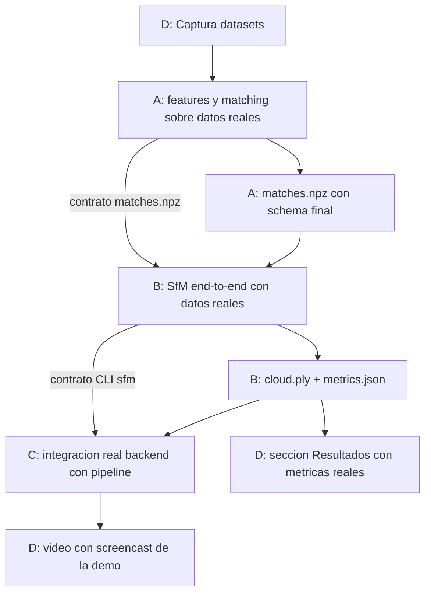
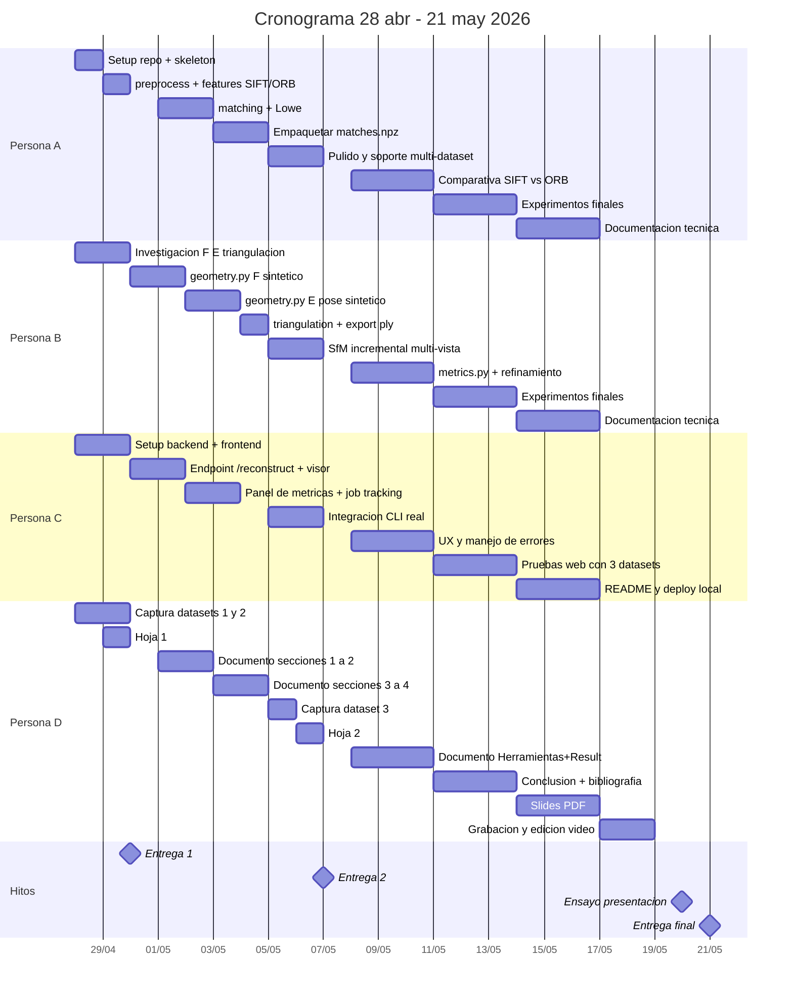

# Plan de proyecto - Reconstruccion 3D desde multiples fotografias

Documentos de referencia:

- [idea-1-3d-reconstruction.pdf](./idea-1-3d-reconstruction.pdf)
- [idea-1-3d-reconstruction.md](./idea-1-3d-reconstruction.md)
- [course-references.md](./course-references.md)

## Contexto

Proyecto final del curso CC3045. Se implementa un pipeline clasico de Structure from Motion que reconstruye una nube de puntos 3D a partir de fotografias tomadas desde distintos angulos, con una demo web para subir las fotos y visualizar el resultado en el navegador.

- Periodo: 28 de abril de 2026 al 21 de mayo de 2026 (24 dias).
- Equipo: 4 integrantes con roles especializados y dependencias minimizadas mediante contratos de interfaz definidos en el dia 1.
- Alcance: solo el core. Quedan fuera segmentacion automatica, LightGlue, SuperGlue, NeRF y Gaussian Splatting.
- Repositorio: ya creado y vacio.

## Principio rector: conocimiento compartido

La especializacion por roles minimiza dependencias en la ejecucion, pero no debe producir silos. La rubrica del curso evalua **Calidad de la solucion (5 pts)** y **Presentacion (5 pts)** sobre todo el equipo: si en la presentacion preguntan sobre el frontend a quien hizo geometria y no sabe responder, se pierden puntos. Los 4 integrantes deben poder explicar el sistema completo a nivel conceptual aunque solo uno haya escrito cada modulo.

Para garantizarlo se aplican estas politicas durante todo el periodo:

- **Bitacora individual diaria**: cada persona registra en `docs/journals/person-<X>.md` que hizo, que probo, que decisiones tomo y por que. Una entrada por dia trabajado, con fecha. La bitacora alimenta directamente la seccion Resultados y Herramientas del documento final.
- **Bitacora de prompts de IA**: cada persona registra en `docs/prompts/person-<X>.md` los prompts a Claude/ChatGPT/Copilot que usaron, con el resultado y la justificacion del uso. Es requisito explicito de la rubrica (seccion Herramientas aplicadas del PDF).
- **Cross-training semanal obligatorio**: cada lunes y jueves (ver cronograma) cada persona presenta a las otras 3 en 5 a 10 minutos: el modulo en el que esta trabajando, una demo en vivo y los conceptos clave que cualquiera deberia saber. Termina con preguntas abiertas para asegurar comprension.
- **Pull requests con revision cruzada**: ningun PR se mergea sin revision de al menos otra persona del equipo (preferencia: el dueno del modulo aguas abajo). El revisor obliga a explicar el codigo, lo que dispersa conocimiento.
- **FAQ compartida**: `docs/faq.md` con las preguntas dificiles que podrian salir en la presentacion y la respuesta consensuada del equipo. Se actualiza despues de cada cross-training.
- **Documento final escrito por todos**: cada seccion tecnica la redacta el dueno del modulo y la revisan al menos otros 2 integrantes. D maqueta y unifica el estilo.

## Resumen de entregas

Las entregas no son hojas sueltas: son hitos con avance funcional verificable en el repositorio publico.

| # | Fecha | Avance funcional esperado | Que se sube en Canvas |
| :--- | :--- | :--- | :--- |
| 1 | Jueves 30 de abril de 2026 | Repo poblado con esqueleto modular, datasets 1 y 2 capturados, deteccion SIFT/ORB corriendo sobre datasets reales, geometria $F$ validada con datos sinteticos, demo web con upload + visor de `.ply` de prueba | Link del repo + Hoja 1 (1 pagina) |
| 2 | Jueves 7 de mayo de 2026 | Pipeline SfM completo end-to-end por CLI sobre dataset 1 (genera `.ply` y `metrics.json`), demo web invocando el pipeline real sobre datasets pre-cargados, dataset 3 capturado, documento final con secciones 1 a 4 redactadas | Link del repo + Hoja 2 (1 pagina) con metricas reales |
| Final | Jueves 21 de mayo de 2026 | Pipeline completo + demo web pulida + experimentos sobre los 3 datasets + documento final + slides + video | Documento PDF + link del repo + slides PDF ($\leq 10$) + video + presentacion en clase |

## Pipeline objetivo

```mermaid
flowchart LR
    A[Fotos de entrada] --> B[Preprocesamiento<br/>Gaussiano + grises]
    B --> C[Keypoints<br/>SIFT / ORB]
    C --> D[Matching<br/>BFMatcher + Lowe ratio test]
    D --> E[RANSAC<br/>Matriz fundamental F]
    E --> F[Matriz esencial<br/>E = K^T F K]
    F --> G[Pose<br/>recoverPose + cheirality]
    G --> H[Triangulacion DLT]
    H --> I[Multi-vista<br/>solvePnPRansac]
    I --> J[Nube de puntos<br/>archivo .ply]
    J --> K[Visualizador Three.js]
```



## Roles y responsabilidades

Para minimizar dependencias entre integrantes, el sistema se divide en 4 frentes independientes con contratos de interfaz claros.

Cada persona tiene **tres responsabilidades** independientes del rol:

1. Mantener su bitacora en `docs/journals/person-<X>.md` con una entrada por dia.
2. Mantener su log de prompts de IA en `docs/prompts/person-<X>.md`.
3. Conducir su slot del cross-training semanal sobre los avances de su modulo.

### Persona A - Pipeline de vision (features y matching)

- Modulos: `backend/src/sfm_pipeline/preprocess.py`, `backend/src/sfm_pipeline/features.py`, `backend/src/sfm_pipeline/matching.py`
- Base de partida: Lab 3 (SIFT/ORB + BFMatcher + Lowe ratio test).
- Salida: archivo `data/<nombre>/matches.npz` con keypoints, descriptors y matches filtrados.
- Dependencias externas: necesita datasets capturados por la persona D. Hasta tenerlos, prueba sobre fotos publicas.
- **Documentacion compartida**: redacta seccion 4.1 (Features y matching) del documento final, contribuye a Slides 4 (Pipeline) y 5 (Herramientas), y responde Q&A sobre por que SIFT vs ORB, parametros de Lowe, RANSAC.

### Persona B - Geometria 3D y reconstruccion

- Modulos: `backend/src/sfm_pipeline/geometry.py`, `backend/src/sfm_pipeline/triangulation.py`, `backend/src/sfm_pipeline/sfm.py`, `backend/src/sfm_pipeline/export.py`, `backend/src/sfm_pipeline/metrics.py`.
- Base de partida: Lab 4 (DLT + RANSAC + SVD) adaptado al algoritmo de 8 puntos.
- Salida: `outputs/<nombre>/cloud.ply` + `outputs/<nombre>/metrics.json`.
- Dependencias externas: consume el `matches.npz` de A. Hasta entonces trabaja con datos sinteticos generados internamente.
- **Documentacion compartida**: redacta secciones 4.2 (Geometria epipolar), 4.3 (Triangulacion), 4.4 (Multi-vista) del documento final, contribuye a Slides 4 y 6 (Resultados), y responde Q&A sobre $F$, $E$, cheirality, error de reproyeccion.

### Persona C - Demo web

- Modulos: `backend/src/sfm_pipeline/api/` (FastAPI) y `frontend/` (Three.js + Vite).
- Base de partida: ninguna del curso, requiere setup desde cero.
- Salida: aplicacion local que recibe ZIP de fotos, ejecuta el pipeline y muestra la nube en el navegador con panel de metricas.
- Dependencias externas: consume el CLI de B `python -m sfm_pipeline.cli --dataset <name>` (ver [`docs/contracts/cli-sfm.md`](contracts/cli-sfm.md)). Hasta entonces, mock que devuelve un `.ply` fijo (Stanford bunny u otro).
- **Documentacion compartida**: redacta seccion 4.5 (Demo web) del documento final, conduce la demo en vivo de Slide 8 y responde Q&A sobre arquitectura cliente-servidor; **debe ser capaz de explicar a nivel conceptual cada etapa del pipeline core** aunque no la haya programado.

### Persona D - Datos, documentacion, metricas y comunicacion

- Modulos: `data/*`, `docs/*`, slides, video, hojas de avance.
- Base de partida: anotaciones del curso ya disponibles (ver [course-references.md](./course-references.md)).
- Salida: tres datasets, hojas 1 y 2, documento final, slides, video.
- Dependencias externas: necesita el codigo de A, B y C terminado para documentar y las metricas reales para la seccion de resultados.
- **Documentacion compartida**: redacta secciones 1 (Problema), 2 (Analisis), 3 (Propuesta), 6 (Resultados con figuras), 7 (Conclusion), 8 (Bibliografia). Maqueta documento, slides y video unificando estilo. Coordina las revisiones cruzadas. Conduce Slides 1 a 3 y 9 a 10 en la presentacion.

## Contratos de interfaz

Estos contratos se acuerdan el dia 1 y permiten que los 4 integrantes trabajen en paralelo desde el inicio.

### Dataset

```text
data/<nombre_dataset>/
├── images/                # fotografias .jpg con EXIF intacto
├── intrinsics.json        # K aproximada desde EXIF (puede generarse despues)
└── README.md              # descripcion del dataset
```

### Matches (A entrega a B)

Archivo `data/<nombre>/matches.npz` con:

- `image_paths`: lista de N rutas relativas a `images/`.
- `keypoints_i` para cada imagen `i`: arreglo $N_i \times 2$ con coordenadas `(x, y)`.
- `descriptors_i` para cada imagen `i`: $N_i \times 128$ (SIFT) o $N_i \times 32$ (ORB).
- `matches_ij` para cada par `(i, j)` consecutivo: $M \times 2$ con indices a los keypoints de cada imagen tras Lowe ratio test.

### Reconstruccion (B entrega a C y a D)

- `outputs/<nombre>/cloud.ply`: nube de puntos en formato ASCII PLY.
- `outputs/<nombre>/metrics.json`:

```json
{
  "dataset": "objeto",
  "num_images": 24,
  "reprojection_error_mean": 1.42,
  "reprojection_error_median": 1.10,
  "ransac_inlier_ratio": 0.72,
  "num_3d_points": 8451,
  "time_per_stage_seconds": {
    "features": 12.3,
    "matching": 8.1,
    "geometry": 4.5,
    "triangulation": 2.7,
    "multiview": 18.2
  }
}
```

### CLI (B entrega a C)

```bash
python -m sfm_pipeline.cli --dataset <nombre>
```

Genera los archivos del schema anterior. C lo invoca como subprocess desde el backend.

## Diagrama de dependencias



Las flechas continuas marcan dependencias duras. Las punteadas son contratos definidos el dia 1 que permiten a B y C avanzar con datos sinteticos o mocks hasta que A y B entreguen lo real.

## Cronograma general



## Entrega 1 - Jueves 30 de abril de 2026

### Avance funcional verificable

- Repositorio poblado con estructura modular y `requirements.txt` instalable.
- Datasets 1 (objeto 360 grados) y 2 (fachada) cargados en `data/`.
- Deteccion SIFT y ORB corriendo sobre los dos datasets, con visualizacion de keypoints.
- Modulo `geometry.py` validado sobre par estereo sintetico (estimacion de $F$ con $\geq 60\%$ de inliers).
- Backend FastAPI con endpoint `POST /reconstruct` que recibe ZIP y devuelve un `.ply` mock.
- Frontend Three.js mostrando el `.ply` de prueba en el navegador.

### Que se hara antes de la entrega

| Fecha | Persona | Actividad |
| :--- | :--- | :--- |
| Mar 28 abr | A | Sembrar repo: `backend/`, `frontend/`, `data/`, `docs/`, `scripts/`, `Makefile`, `docker-compose.yml`, `.env.example`. Configurar entorno Python (`backend/requirements.txt`) con `opencv-contrib-python`, `numpy`, `pyyaml` |
| Mar 28 abr | B | Investigacion profunda: algoritmo de 8 puntos, descomposicion de $E$, triangulacion DLT. Generar par estereo sintetico para pruebas |
| Mar 28 abr | C | Setup `backend/src/sfm_pipeline/api/` con FastAPI + endpoint `/health`. Setup `frontend/` con Three.js mostrando un cubo |
| Mar 28 abr | D | Captura dataset 1 (objeto pequeno 360 grados, 20 a 30 fotos con solapamiento $\geq 60\%$). Lectura de `course-references.md` |
| Mar 28 abr | Todos | Reunion para acordar contratos de interfaz (ver seccion correspondiente) |
| Mie 29 abr | A | `preprocess.py` (Gaussiano + conversion a grises) y `features.py` (SIFT y ORB) probados sobre dataset 1 |
| Mie 29 abr | B | `geometry.py`: estimacion de $F$ con `cv2.findFundamentalMat` + RANSAC validada sobre par sintetico |
| Mie 29 abr | C | Endpoint `POST /reconstruct` recibiendo ZIP. Frontend con upload + visor de un `.ply` fijo (bunny u otro) |
| Mie 29 abr | D | Captura dataset 2 (fachada). Redactar Hoja 1 con propuesta detallada |

### Que se entrega en Canvas

- Link del repositorio publico.
- Hoja 1 en PDF (una sola pagina) con: integrantes, problema, solucion propuesta, pipeline, tecnologias, mini cronograma, link al repo y un parrafo del estado actual.

## Entrega 2 - Jueves 7 de mayo de 2026

### Avance funcional verificable

- Pipeline SfM end-to-end por CLI: `python -m sfm_pipeline.cli --dataset gamecube` produce `cloud.ply` + `metrics.json` en `outputs/gamecube/`.
- Reprojection error medio $< 2$ px en al menos uno de los datasets.
- Demo web invocando el pipeline real sobre dataset pre-cargado: subes ZIP, ves la nube en el navegador y un panel con metricas.
- Dataset 3 (escena interior) capturado y subido.
- Documento final con secciones 1 a 4 redactadas (Problema, Analisis, Propuesta, Descripcion de la solucion).

### Que se hara antes de la entrega

| Fecha | Persona | Actividad |
| :--- | :--- | :--- |
| Vie 1 may | A | `matching.py`: BFMatcher / FLANN + Lowe ratio test. Visualizacion de matches |
| Vie 1 may | B | `geometry.py`: matriz $E = K^T F K$, `recoverPose` con cheirality check, validado en sintetico |
| Vie 1 may | C | Frontend con visor 3D rotable, zoom y carga del `.ply` de prueba estabilizada |
| Vie 1 may | D | Documento final: redactar Descripcion del problema y Analisis (estado del arte, COLMAP, Meshroom) |
| Sab 2 may | A | Empaquetar pipeline de A en formato `matches.npz` con el schema acordado |
| Sab 2 may | B | Continuar matriz $E$ y pose. Construccion de $K$ desde EXIF |
| Sab 2 may | C | Panel lateral de metricas en el frontend. Backend con tracking del job (estado y log) |
| Sab 2 may | D | Documento final: continuar Analisis |
| Dom 3 may | A | Validar `matches.npz` sobre dataset 1 y 2. Entregar a B |
| Dom 3 may | B | Consumir `matches.npz` real. Validar $F$, $E$ y pose en par real del dataset 1 |
| Dom 3 may | C | Definir interfaz CLI con B. Adaptar backend para invocar `python -m sfm_pipeline.cli` cuando este disponible |
| Dom 3 may | D | Documento final: redactar Propuesta de solucion |
| Lun 4 may | A | Soporte para dataset 3 cuando D lo entregue. Optimizacion de tiempos |
| Lun 4 may | B | `triangulation.py` con `cv2.triangulatePoints` y `export.py` a `.ply`. Validar nube en Open3D sobre par real |
| Lun 4 may | C | Frontend pulido: indicadores de progreso, errores, validacion de uploads |
| Lun 4 may | D | Documento final: redactar Descripcion de la solucion |
| Mar 5 may | A | Comparativa preliminar SIFT vs ORB en metricas |
| Mar 5 may | B | `sfm.py` orquestador multi-vista con `solvePnPRansac` y fusion de nubes |
| Mar 5 may | C | Integracion real: backend invoca el CLI de B sobre carpeta de prueba |
| Mar 5 may | D | Captura dataset 3 (escena interior) |
| Mie 6 may | A | Pulido del pipeline + manejo de errores en imagenes con bajo contraste |
| Mie 6 may | B | `metrics.py`: reprojection error, porcentaje de inliers, densidad, tiempos. End-to-end completo sobre dataset 1 |
| Mie 6 may | C | Demo web mostrando dataset 1 procesado por el pipeline real con metricas |
| Mie 6 may | D | Redactar Hoja 2 con metricas reales del dataset 1 |

### Que se entrega en Canvas

- Link del repositorio publico (con el pipeline corriendo y la demo web invocando el pipeline).
- Hoja 2 en PDF (una sola pagina) con: estado actual, tabla de metricas del dataset 1, una figura de la nube, bloqueos, pendientes y link al repo.

## Entrega final - Jueves 21 de mayo de 2026

### Avance funcional verificable

- Pipeline SfM corriendo sobre los 3 datasets desde la demo web.
- Tabla final de metricas con los 3 datasets.
- README del repo con instrucciones de instalacion y uso.
- Documento PDF completo con todas las secciones requeridas.
- Slides PDF con $\leq 10$ laminas.
- Video explicativo (3 a 5 minutos).

### Que se hara antes de la entrega

| Fecha | Persona | Actividad |
| :--- | :--- | :--- |
| Vie 8 may | A | Comparativa SIFT vs ORB profundizada con grafica |
| Vie 8 may | B | Refinamiento de triangulacion. Filtros de outliers en la nube |
| Vie 8 may | C | UX: estados de loading, mensajes de error claros, confirmaciones |
| Vie 8 may | D | Documento final: seccion Herramientas aplicadas con los prompts de IA usados y su justificacion |
| Sab 9 may | A | Validacion sobre dataset 2 y 3. Ajuste de parametros |
| Sab 9 may | B | Validacion sobre dataset 2. Diagnostico de drift sin bundle adjustment |
| Sab 9 may | C | Validacion: probar la web subiendo un dataset y ver la nube completa |
| Sab 9 may | D | Documento final: continuar Herramientas |
| Dom 10 may | A | Soporte de imagenes con metadata EXIF rota (defaults sensatos) |
| Dom 10 may | B | Validacion sobre dataset 3 |
| Dom 10 may | C | Manejo de archivos grandes (ZIP $> 100$ MB) |
| Dom 10 may | D | Documento final: empezar Resultados con figuras y tablas |
| Lun 11 may | A, B, C | Experimentos finales sobre los 3 datasets desde la web |
| Lun 11 may | D | Recolectar metricas finales y figuras (keypoints, matches, nubes, error vs cobertura angular) |
| Mar 12 may | A, B, C | Continuar experimentos. Ajustes finos |
| Mar 12 may | D | Documento final: completar seccion Resultados |
| Mie 13 may | A, B | Cleanup de codigo, comentarios, docstrings |
| Mie 13 may | C | Pulido final de la demo web |
| Mie 13 may | D | Revision tecnica del documento con A y B |
| Jue 14 may | A | Documentacion tecnica del modulo de features y matching |
| Jue 14 may | B | Documentacion tecnica del modulo de geometria y SfM |
| Jue 14 may | C | README detallado de la demo web |
| Jue 14 may | D | Slides PDF: laminas 1 a 4 (problema, propuesta, pipeline, herramientas) |
| Vie 15 may | A, B | Apoyar D con secciones tecnicas del documento |
| Vie 15 may | C | Configurar deploy local reproducible |
| Vie 15 may | D | Slides PDF: laminas 5 a 8 (resultados, demo, conclusion) |
| Sab 16 may | Todos | Revision cruzada del documento. Conclusion y Bibliografia |
| Sab 16 may | D | Slides PDF: laminas 9 a 10 (referencias). Export final |
| Dom 17 may | C, D | Grabacion del video: screencast de la web procesando un dataset + voiceover |
| Lun 18 may | D | Edicion del video |
| Mar 19 may | Todos | Revision final cruzada del documento, slides y video |
| Mie 20 may | Todos | Ensayo de la presentacion en clase. Buffer para imprevistos |

### Que se entrega en Canvas

- Documento PDF final con: Descripcion del problema, Analisis, Propuesta de solucion, Descripcion de la solucion, Herramientas aplicadas (con prompts de IA y justificacion), Resultados, Conclusion, Bibliografia.
- Link del repositorio publico con todo el codigo, los 3 datasets y el documento.
- Slides PDF ($\leq 10$ laminas).
- Video explicativo (3 a 5 minutos).
- Presentacion en clase.

## Estructura del repositorio

```text
.
├── README.md
├── Makefile
├── docker-compose.yml
├── .env.example
├── .gitignore
├── backend/                        # Python 3.12 + OpenCV + FastAPI (mv3d-hartley)
│   ├── Dockerfile
│   ├── requirements.txt
│   ├── pyproject.toml
│   ├── scripts/                    # scripts Python de uso unico (orb_test, etc.)
│   ├── src/sfm_pipeline/
│   │   ├── preprocess.py           # Persona A
│   │   ├── features.py             # Persona A
│   │   ├── matching.py             # Persona A
│   │   ├── geometry.py             # Persona B
│   │   ├── triangulation.py        # Persona B
│   │   ├── sfm.py                  # Persona B
│   │   ├── export.py               # Persona B
│   │   ├── metrics.py              # Persona B
│   │   ├── cli.py                  # CLI: python -m sfm_pipeline.cli --dataset <name>
│   │   ├── config.py               # carga .env + datasets.yaml
│   │   └── api/server.py           # FastAPI (Persona C)
│   └── tests/
├── frontend/                       # Three.js + Vite + pnpm (mv3d-galileo, Persona C)
│   ├── Dockerfile
│   ├── package.json
│   ├── vite.config.js
│   ├── index.html
│   └── src/
│       ├── main.js
│       ├── viewer/pointCloudViewer.js
│       └── styles/main.css
├── data/                           # datasets de entrada
│   ├── datasets.yaml               # registro central
│   ├── gamecube/{images,intrinsics.json,README.md}
│   └── other/{images,intrinsics.json,README.md}
├── outputs/                        # cloud.ply y metrics.json por dataset
├── scripts/                        # scripts shell (01_start, 06_pipeline, etc.)
└── docs/
    ├── plan.md                     # este archivo
    ├── summary.md
    ├── course-references.md
    ├── idea-1-3d-reconstruction.md
    ├── faq.md                      # Q&A consensuada del equipo
    ├── contracts/                  # contratos de interfaz entre modulos
    ├── theory/                     # copia literal de anotaciones (semanas 1-7)
    ├── lectures/                   # apuntes propios del equipo
    ├── journals/                   # bitacora diaria (person-a/b/c/d.md)
    ├── prompts/                    # log de prompts de IA (person-a/b/c/d.md)
    ├── presentation/               # slides + video
    └── final/                      # document.md, diagrams/, results/
```

## Mapeo a temas del curso

| Tema | Semana | Modulo | Responsable |
| :--- | :--- | :--- | :--- |
| Filtrado y convolucion (Gaussiano) | 2 | `preprocess.py` | A |
| SIFT y ORB | 4 | `features.py` | A |
| Matching + Lowe ratio test | 4 | `matching.py` | A |
| RANSAC | 4, 5 | `geometry.py` | B |
| Geometria proyectiva, $F$ y $E$ | 5, 6, 7 | `geometry.py` | B |
| Homografias y poses relativas | 5 | `geometry.py` | B |
| Triangulacion | 7 | `triangulation.py` | B |
| Morfologia matematica | 3 | `preprocess.py` | A (opcional) |

Detalle ampliado de relevancia y reuso de los labs en [course-references.md](./course-references.md).

## Distribucion de slides y presentacion

El PDF del curso exige slides PDF con $\leq 10$ laminas y una presentacion en clase. La autoria de cada lamina la asume el dueno del contenido para que pueda defenderlo en el Q&A; D maqueta y unifica estilo visual.

| Slide | Contenido | Autoria tecnica | Quien presenta en clase |
| :--- | :--- | :--- | :--- |
| 1 | Portada + integrantes + problema en una linea | D | D |
| 2 | Descripcion del problema y motivacion | D | D |
| 3 | Analisis: estado del arte (COLMAP, Meshroom) | D + B (revisa) | D |
| 4 | Propuesta y pipeline (diagrama mermaid renderizado) | A + B | B |
| 5 | Herramientas: stack tecnico + uso de IA | A + B + C | A |
| 6 | Resultados cuantitativos: tabla y graficas de metricas | B + D | B |
| 7 | Resultados cualitativos: figuras de keypoints, matches y nubes | A + B + D | A |
| 8 | Demo web en vivo (screencast o demo real) | C | C |
| 9 | Conclusion y limitaciones (drift, $K$ aproximada) | Todos | D |
| 10 | Bibliografia y referencias | D | D |

**Ensayo Mie 20 may**: cada quien presenta sus laminas con cronometro y los demas hacen de jurado con preguntas dificiles. Se actualiza `docs/faq.md` despues del ensayo.

## Mapeo de la rubrica de evaluacion (25 puntos)

Cada criterio tiene un responsable principal y entregables concretos en el repositorio.

| Criterio | Pts | Que se evalua | Entregables clave | Responsable principal |
| :--- | :--- | :--- | :--- | :--- |
| Aprobacion de la idea | 3 | Idea aprobada en su momento | [idea-1-3d-reconstruction.md](./idea-1-3d-reconstruction.md) ya aprobada | D |
| Documento | 5 | 8 secciones completas y bien escritas | `docs/final/document.md` (fuente) y `docs/final/document.pdf` (entregable) | D maqueta, todos contribuyen |
| Repositorio | 1 | Codigo organizado, README claro, instalable | `README.md`, `requirements.txt`, estructura modular | A coordina, todos commitean |
| Video | 1 | 3 a 5 min explicando solucion + demo | Video subido al repo o link | C graba demo, D edita |
| Slides | 5 | $\leq 10$ laminas claras y bien diseñadas | `docs/slides.pdf` | D maqueta, autoria distribuida (ver tabla anterior) |
| Presentacion | 5 | Claridad expositiva + Q&A solvente | Ensayo previo, FAQ compartida, distribucion oratoria | Todos |
| Calidad de la solucion | 5 | Pipeline funcional, metricas sanas, demo robusta | Reprojection error $< 2$ px, demo procesando 3 datasets | A + B + C |

## Metricas objetivo

| Metrica | Descripcion | Objetivo |
| :--- | :--- | :--- |
| Reprojection error | $\|x_i - \hat{x}(P, X_i)\|$ en pixeles | $< 2$ px |
| Inliers RANSAC | Porcentaje de correspondencias validas | $> 60\%$ |
| Densidad de la nube | Puntos reconstruidos vs intentados | Maximizar |
| Tiempo de procesamiento | Por imagen y total del pipeline | Documentar |
| Cobertura angular | Minimo de angulos para calidad aceptable | Evaluar |

## Riesgos y mitigaciones

| Riesgo | Mitigacion | Responsable |
| :--- | :--- | :--- |
| $K$ no disponible (sin tablero de calibracion) | Aproximar desde EXIF: $f_{px} \approx f_{mm} \cdot W / s_{mm}$. Documentar como limitacion | B |
| Datasets sin solapamiento suficiente | Re-capturar antes del 1 may con $\geq 60\%$ de solape, textura visible y buena luz | D |
| Drift acumulado sin bundle adjustment | Reportar en Conclusion como limitacion conocida del enfoque incremental sin BA | B y D |
| Atraso en la integracion C-B (CLI) | C trabaja con mock hasta el 5 may. Si el CLI no esta listo, fallback a screencast con CLI manual | C |
| Atraso en algun rol critico | Reuniones de sincronizacion los lunes y jueves. Reasignacion temprana si alguien se atasca $> 1$ dia | Todos |
| Conflictos de merge en el repo | Branches por persona (`feat/A-features`, `feat/B-geometry`, etc.). Pull requests con revision cruzada | Todos |

## Sincronizaciones obligatorias

Para que el plan paralelo funcione sin perder conocimiento compartido, hay dos tipos de reuniones:

### Hitos de integracion (acoplamientos duros)

- **Mar 28 abr**: kick-off y firma de los contratos de interfaz.
- **Dom 3 may**: A entrega `matches.npz` real a B; B confirma que el schema funciona.
- **Mie 6 may**: B entrega CLI funcional a C; pre-flight de la entrega 2.
- **Lun 11 may**: arranque de los experimentos finales con los 3 datasets.
- **Mie 20 may**: ensayo final de la presentacion.

### Cross-training semanal (conocimiento compartido)

Reuniones recurrentes de 30 a 45 minutos. Cada persona toma un slot de 5 a 10 minutos para presentar avances al resto, con demo si aplica. Se cierra con preguntas y se actualiza `docs/faq.md`.

- **Jue 30 abr** (post entrega 1): cada quien muestra que dejo funcionando (skeleton, features, geometria sintetica, demo mock, datasets).
- **Lun 4 may**: midpoint cross-training, foco en geometria $F$/$E$ y matching real.
- **Jue 7 may** (post entrega 2): walkthrough end-to-end del pipeline. Todos deben poder ejecutar el CLI localmente.
- **Lun 11 may**: cross-training de experimentos. Todos deben entender las metricas.
- **Vie 15 may**: review tecnica del documento. Cada autor explica su seccion al resto.
- **Mar 19 may**: review final integrado del documento, slides y video con preguntas dificiles cruzadas.
